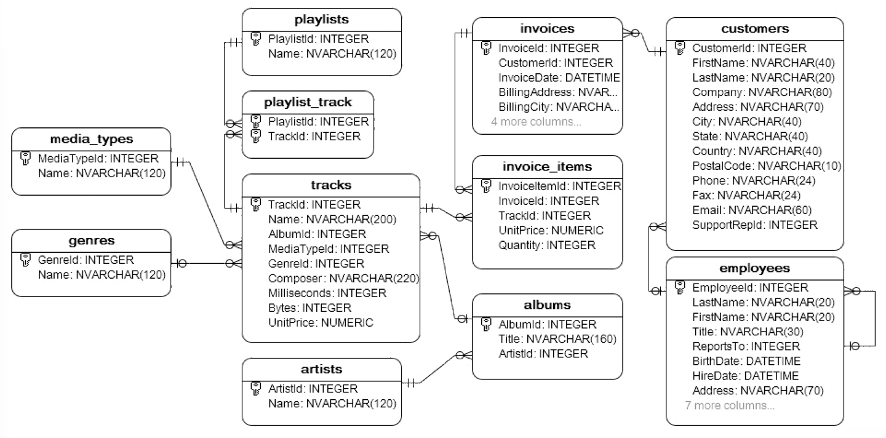

```{r setup, include=FALSE}
knitr::opts_chunk$set(echo = TRUE)
```

## Question 1

**(50 Points) Choose a database recovery problem or scenario (perhaps from work) and then propose a solution using the techniques described in Chapter 11 in the textbook. Briefly describe the technique, when it is appropriate to use and what recovery problem it solves.**

Consider an imaginary database that holds information on people buying tickets for an upcoming Taylor Swift concert. There are several relations in the database: 

* A **Customer** table, which has *cid*, *name*, *status*, and *timestamp* fields. *status* is one of "bought tickets", "buying tickets", or "in queue". The timestamp is the time at which a customer entered the queue and determines their order in the queue. 
* A **tickets** table, which has *tid*, *location*, and *price*.
* A **sale** table, which contains a *cid* and *tid* to indicate that a customer purchased a ticket. Customers can purchase multiple tickets. 

This database is being accessed by a variety of concurrent transactions, including transactions to move customers out of the queue, sell tickets, and add new customers. Suppose that an extremely high volume of new customers in queue could cause the system to crash (**computer failure**). How could we handle this type of failure? 

I propose using the **ARIES recovery algorithm** to restore the database after a non-catastrophic crash such as a system failure. ARIES uses a steal/no-force approach to optimize flexibility and performance and is appropriate for a high-concurrency database. It solves recovery concerns such as needing fast bounceback and restoring all potentially lost data (eg. newly purchased tickets). 

First, during normal execution, we ensure that we maintain a **system log** recording essential actions in the database, including page updates and undos and committing, aborting, or ending a transaction. We use **write-ahead logging** so that log records are written to stable storage *prior* to changing the database. Additionally, we add periodic **checkpoints** into the log to reduce recovery time using **fuzzy checkpointing** to reduce runtime. Since this database will have high concurrency, we also maintain a **transaction table** and **dirty log table**, which track active transactions and dirty pages in the buffer respectively. 

After a crash, the recovery manager can apply the ARIES algorithm in three phases. In the *analysis* phase, the transaction and dirty page tables are accessed and reconstructed since the last checkpoint. In the *redo* phase, we redo all transactions/changes that weren't force-written to disk. In the *undo* phase, we undo any transactions that weren't fully committed. After all three phases are complete, normal execution can resume and fans can continue to purchase tickets. 


## Question 2

**(50 Points) Using any of the SQLite database we have previously worked with, write an update that requires related modification of multiple tables and conduct those updates within a transaction. Test the code so that you show that the transaction works and write one test where the transaction fails and rolls back.**

I am working with the MediaDB database, and will write a transaction that creates a new playlist with a given set of tracks. 

```{r echo = FALSE, out.width = '100%', fig.align = 'center'}

```

```{r, results='hide', message=FALSE, warning=FALSE}
library(RSQLite)

db <- dbConnect(SQLite(), "MediaDB.db")
```

```{r}
#' Creates a playlist with desired tracks
#' Assumption: The new playlist name is unique. 
#' 
#' @param dbcon the database
#' @param playlist_name the name of the new playlist
#' @param tracks vector of trackIDs for any tracks to add to the playlist
#' @return status -- TRUE if success, FALSE otherwise
createPlaylist <- function (dbcon, playlist_name, tracks) {
  
  dbExecute(dbcon, "BEGIN TRANSACTION")
  
  tryCatch({
    # create new playlist
    sql <- paste0("INSERT INTO playlists(Name) VALUES ('", 
                  playlist_name, "');")
    dbSendStatement(dbcon, sql) |>
      dbClearResult()
    
    # retrieve playlistId for new item
    pid <- dbGetQuery(dbcon,
                 paste0("SELECT PlaylistId FROM playlists ",
                         "WHERE Name = '", playlist_name, "'"))[[1, 1]]
    
    # insert new rows into playlist_track for any tracks 
    sql <- paste("INSERT INTO playlist_track(PlaylistID, TrackId) VALUES",
                 paste("(", pid, ",", tracks, ")", collapse = ","))
    dbSendStatement(dbcon, sql) |>
      dbClearResult()
    
    dbExecute(dbcon, "COMMIT TRANSACTION")
    
    return(TRUE)
    
  }, error = function(e) {
    
    # rolling back if anything breaks
    dbExecute(dbcon, "ROLLBACK TRANSACTION")
    return(FALSE)
  })
}
```

**Does the transaction work with valid input?**

```{r}
createPlaylist(db, "Dog Songs", c(16, 1580, 1606, 1610, 2412, 3096, 3369))
```
```{sql connection = db}
SELECT * FROM playlists WHERE Name = "Dog Songs"
```
```{sql connection = db}
SELECT * FROM playlist_track WHERE PlaylistId = 19
```

**Does the transaction rollback with invalid input?**

```{r}
createPlaylist(db, "Dog Songs 2", c(16, 16, 16, 16))
```

```{sql connection = db}
SELECT * FROM playlists WHERE Name = "Dog Songs 2"
```

```{r}
dbDisconnect(db)
```