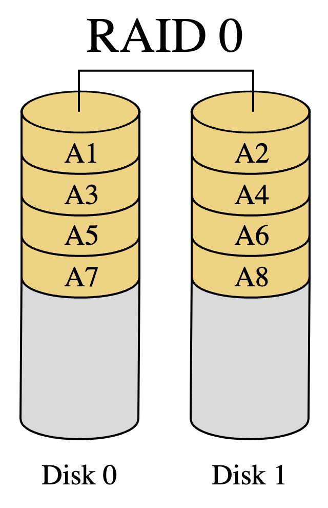
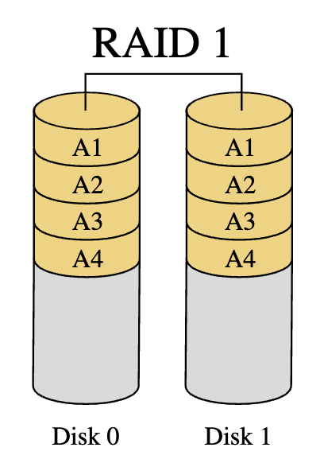
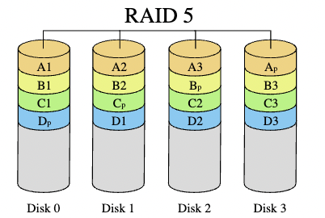
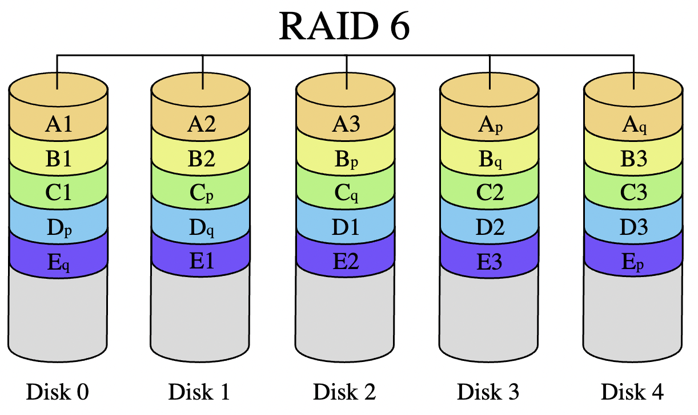

```{r setup, include=FALSE}
knitr::opts_chunk$set(echo = TRUE)
```

[lesson link](http://artificium.us/lessons/92.systems/l-92-501-raid/l-92-501.html)

Data must be stored on a physical device with non-volatile memory, *i.e.* memory that does not require constant power supply. 

## Storage devices

* in-computer memory, eg. RAM, cache, is volatile -- contents will be lost if power supply is lost. 
* non-volatile storage includes mechanical hard disk drives, solid-state devices (eg. flash drives), CD-ROM, DVD, tape. 
  * most common for databases, file systems are mechanical and solid state devices

## Mechanical disk drives

[video link](https://youtu.be/NtPc0jI21i0)

Data is stored on a disk magnetically as 1 or 0, aka magnetic bits facing north or south. 

**Transducers**: 

* data is read and written via transducers -- devices converting one type of energy to another 
  * the transducer head has separate elements to read and write data 
  * the head is attached to an arm which moves along **strokes** (rings around disk) to read/write data
  * when powered off, the head swings off the disk to rest to the side 
  * the arm moves very precisely to a given address
  
## Solid-State Disk Drives

SSDs are slightly more expensive and have smaller capacities, BUT are far more reliable and extremely fast. (good example - smartphone drives)

* SSDs have a limited number of "write cycles" -- therefore they aren't good for high-volume transactional databases

**Structure**:

* Charge trap flash memory cell (CTF)
  * store difference levels of electrons inside a charge trap
  * old technology could only do 2 levels - lots of electrons or very few (1/0)
    * can hold 8/16 levels of electrons, meaning that each CTF can store 3 or 4 bits long term (decades)
      * SLC (0 or 1), vs. MLC (multi-bytes)
* Vnand (vertical nand) -- stack of memory cells, eg. string
  * **control gates** attached to string ensure that one CTF within a string is read at a time
  * information relayed to **bitline** at the top 
* strings are arranged into 2d **pages**, of which each row shares a control gate
* pages arranged into 3d **blocks**, so that bitlines are connected
  * **bitline selectors** at top ensure that only one row can use bitline at a time
  
```{r echo=FALSE, out.width="45%", out.height="20%",fig.cap = 'SSD components', fig.show='hold',fig.align='center'}
knitr::include_graphics(c("dd_raid/SSD_dimensions.png","dd_raid/SSD_memorychip.png"))
``` 
  
### Comparing to Mechanical drives

Advantages:

  * no moving components means that SSDs are silent, use less power, and are much less fragile
  * SSDs can also read data much faster because they're not reliant on the speed of the arm

Disadvantages: 

  * high storage cost per gigabyte
  * lower drive capacities
  * relatively low write speed 
  * wear leveling -- reduces performance over time and causes encryption issues 
## RAID: Redundant Array of Independent Devices

Commonly used method to prevent loss of data, such that the storage system continues to function even when a disk or disk data is lost. 
  * provide protection against/recovery from hardware failures and defective drive hardware
  * no protection against data loss from environmental failures, eg. fire or flooding 
  * data centers must guard against such events through distributed storage across physical locations

RAIDs require at least two storage devices -- data is copied, mirrored, or striped across devices in the array. There are different RAID configurations distinguished by how they write data across the array. RAID 0 (striping), 1 (mirroring), 5 (distributed parity), and 10 (1 and 0) are most common. 

* RAID 0: data is striped across devices without parity which improves performance but does not add any fault tolerance
* RAID 1: data is mirrored onto devices to improve fault tolerance and performance
* RAID 2: data is striped across devices at the bit level with a parity code written to a separate device; improving fault-tolerance; rarely used in practice
* RAID 3: data is striped across devices at the byte level with a parity code written to a separate device improving fault-tolerance; rarely used in practice
* RAID 4: data is striped across devices at the block level with a parity code  written to a separate device improving fault-tolerance and performance
* RAID 5: data is striped along with error correcting parity codes across the devices improving fault-tolerance and performance
* RAID 6: same as RAID 5 but with two parity codes allowing for increased fault tolerance but lower performance than RAID 5
* RAID 10: a combination of RAID 0 and 1

### RAID 0 

* data is striped evenly across devices without any parity (error correcting) information. 
  * marginally improves read/write performance, but has no fault tolerance -- if a device fails, entire array is compromised 
* can be used build single large storage device from multiple devices 
  * array can be made from devices with differing capacities -- actual capacity limited to smallest device capacity * number of devices 
  * array of *n* storage devices provides read/write rates up to *n* times higher than individual access rates
* **Use cases**: environments with high performance needs that can tolerate lower reliability, *e.g.* scientific computing. 
  * not appropriate for databases 
  
```{r echo=FALSE, out.width="20%", fig.show='hold',fig.align='center'}

``` 
  
### RAID 1

* data is exactly mirrored onto 2+ storage devices
* devices split into two equal size groups 
* fault tolerance holds so long as only one of the original and mirror are damaged
* allows for parallel retrieval, increasing performance
* write performance degraded as data is written twice -- but if done in parallel, no worse than single performance 
* **Use case**: useful when read performance more important than write performance

```{r echo=FALSE, out.width="20%", fig.show='hold',fig.align='center'}

``` 

### RAID 5

* strips data across storage devices in blocks and includes parity (error correcting) information across devices
* can sustain at most one device failure  
  * in case of failure, info on failed device reconstructed from remaining data and parity data 
  * reconstruction is computationally intensive, resulting in slow performance
* requires >= 3 disks
* offers read performance due to parallel processing; write performance degraded as parity information calculated

```{r echo=FALSE, out.width="20%", fig.show='hold',fig.align='center'}

``` 

### RAID 6

* Extends RAID 5 by adding another parity block, allowing for two device failures
* slower write performance and less capacity than RAID 5, but is more fault tolerant
* same read performance as RAID 5
* requires >= 4 disks

```{r echo=FALSE, out.width="20%", fig.show='hold',fig.align='center'}

``` 

### Choosing a RAID configuration

* choice of a RAID configuration depends on use case of system and desired degree of fault tolerance
* RAID 1 best for cases when fault tolerance is needed and cost is not a factor
* RAID 0 best to optimize read performance and cost, ignoring fault tolerance
* RAID 10 best for a higher-cost system with benefits of RAID 1 and RAID 0
  * best for transactional system that must be highly available 
* RAID 5 and 6 strike balance between cost, fault tolerance, and increased performance at cost of write performance
  * good choice for data warehouses

### RAID Controllers

RAID systems must be controlled by software or hardware. 

* either done within operating system (software) or dedicated hardware-based controllers 
  * hardware controller usually has its own embedded OS 
* usually dedicated hardware-based controller is faster and more reliable


