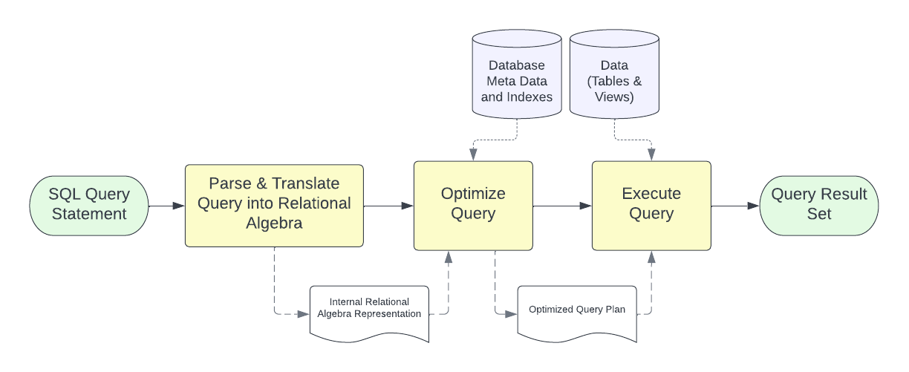
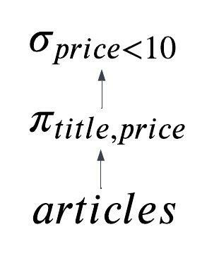

```{r setup, include=FALSE}
knitr::opts_chunk$set(echo = TRUE)
```

[lesson link](http://artificium.us/lessons/60.dbdesign/l-60-551-query-processing/l-60-551.html)

Query processing: activities involved in carrying out a client command's request

* involves translation of SQL statement to low-level access operations, query optimization, actual access of data
* Query optimization involved translation to relational algebra, specifiying alternative but equivalent query execution plans, scoring each plan based on time/memory/access, determining the most efficient plan 

## Query Evaluation Process

There are three phases to query processing: parsing/translation, optimization, and execution. During parsing, the parser performs a syntax check of the SQL statement.



### Translation

* The query is translated into any equivalent extended relational algebra expressions. 

**Parse trees**: since there are multiple ways to express a query, the expression is represented as a parse tree.

* *equivalence rules* include a variety of methods to transform queries into alternative forms. Some of those rules are listed on reference page. 

```{sql eval = FALSE}
select title, price
  from articles
 where price < 10;
```

$\sigma_{price<10}(\pi_{title, price}(articles))$ OR $\pi_{title, price}(\sigma_{price<10}(articles))$

Parse tree for first query: 



* all possible parse trees are generated.
* for each step in  each parse tree (starting at leaves), an operation is chosen to execute the step.
* Each operation has an associated "cost", measured in computational time and memory. 
* query optimizer chooses the plan with the lowest "cost" given set memory, resources, etc.
* optimized query given to query evaluation engine, which carries out operations and produces result
* result eventually packed into network message, returned to client where database API unpacks message, builds data structure, and returns structure to the client application

## Ordering Results

`ORDER BY` must be explicitly specified to order returned tuple. 

* sorting is expensive and common sorting algorithms require all data in memory
  * data usually too large -- must be sorted in secondary storage
* sorting also used to find and eliminate duplicates
* sort can be applied to input relationships before a join operation, union, intersection, etc. to improve efficiency. 
  * applicable indexes don't require sorting, but for large tables sorting the tuples if preferably since accessing index requires more memory. 
  
## Access Operations

There is no single "best way" to carry out an operation -- choice often depends on relation size, memory, data speed, indexes, concurrency, and cached results from prior operations

Common operations: 

* **use of index**: common for selection and joins; uses an index to find tuples satisfying query conditions
* **iteration**: linearly scanned and all tuples examined. generaly the slowest (O(n)). 
* **partitioning**: tuples are partitioned using internal sorting/hashing algorithms to find tuples meeting criteria
  * hashing has O(1) lookup but creation is time consuming.
  * sorting is slow O(nlogn) but easy to partition

Joins are usually the most expensive operations -- worst case they require a nested loop algorithm, $O(n^2)$. 

## Query Costing ##

The "cost" of a query is foundation for choosing query plan. There are many costs to consider: 

* cost of accessing secondary storage, eg. disks
* cost of storing intermediate results in secondary storage, related access costs
* cost of computation eg. CPU use
* cost of storing results in main memory
* cost of transferring results from servers or remote database via networks


