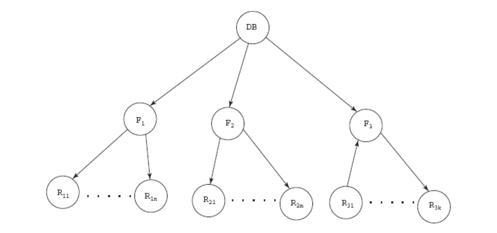
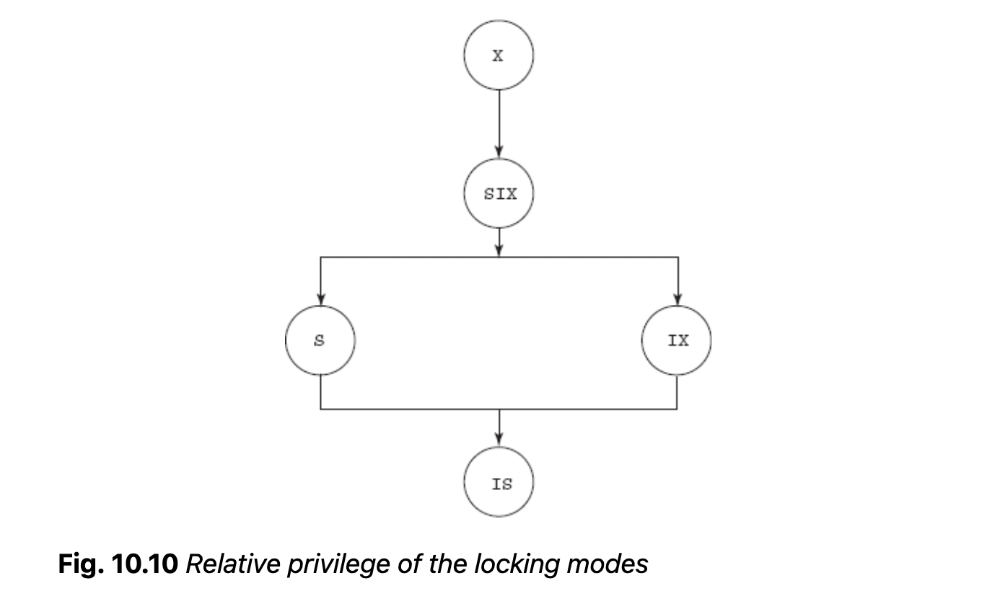
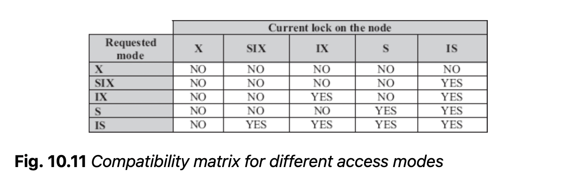
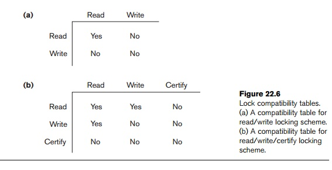

```{r setup, include=FALSE}
knitr::opts_chunk$set(echo = TRUE)
```

[Textbook chapter](concurrency_txt.pdf)

*The need of concurrency control techniques

**concurrency control techniques** control interactions among current transactions s.t. integrity is conserved by avoiding interference.

* ensure serializability order
* types: locking, timestamp-based, optimistic, multiversion

## Locking

**lock**: variable associated with each data item indicating whether a read/write is allowed. Acquiring the lock by modifying its value is **locking**. 

* **exclusive lock** -- provides transaction exclusive control on data item 
* **shared lock** -- acquired during read-only operations, where multiple transactions can acquire shared lock at a time. 

### Implementing Locking

A lock is a control block containing information about the nature of the locked data and the id of the transaction with the lock. 

**lock manager**: dbms subsystem handling locking/unlocking the data. 

* Receives lock requests from transactions and replies with lock grant message or rollback, also receives and accepts unlock requests 
* Implements priority technique such that there's no **starvation** of transactions, *e.g.* a transaction waits indefinitely for an exclusive lock while shared locks are continuously used. 
* lock manager maintains a **lock table** or hash table with information on transaction requests

### Lock based techniques

Transactions may release lock immediately after final access of a data item, but this may not always be desirable with interleaved execution.

**Deadlock** -- when all transactions in simultaneous wait state as each is waiting for release of data items held by one of the others. More desirable than inconsistent state. 

**Two phase locking**: each transaction divided into a *growing* phase, where it acquires all needed locks, and a *shrinking* phase where it releases. 
  * lower degree of concurrency, but forces serializable schedules
  * rollback and deadlock are still possible 
  * **strict two-phase locking**: transaction does not release any exclusive locks until commit/abort. prevents cascading rollback

**Lock Conversion**: transaction changes lock from one mode to another on existing held lock. Allows for more concurrency.

**Graph Based Locking**: Used when access order is known in advance.
  * directed, acyclic **database graph** is formed with data items as nodes and edges denote the need for access prior to another data item. 
  * locks can only be placed if the transaction has locked its parent. 
  * ensures conflict serializability and deadlock freedom
  * recoverability/cascadelessness not ensured
  * transaction may have to lock data items it doesn't need to access
  
### Specialized Locking Techniques

**Predicate locking**: all tuples, existing or future, that satisfy an arbitrary predicate are locked
  * prevents **phantom tuples**, e.g. failing to consider new items
  * expensive!

**Index locking**: any transaction inserting a tuple with satisfying a predicate must insert data entry into an index dependent on outside locks.

**Concurrency in tree-structured indexes**: 
* two-phase locking results in low concurrency, as index searching starts at the root
* *crabbing*: releasing lock on parent, acquiring child, so on. Possibility of deadlock 
* *B-link tree*

### Multiple-Granularity Locking

* **locking granularity** - size of locked data item. course = large, eg. table/database, fine = small eg. tuple/attribute. 
  * course granularity has less overhead and less concurrency
* Database provides range of granularities for locking to satisfy dissimilar requests.
* long transactions use coarse granularity, short transactions use fine granularity to optimize concurrency/overhead tradeoff
* **lock escalation**: transaction starts by locking at fine g and works up to coarse as needed

```{r out.width = '50%', fig.align = 'center'}

```

One concern is that in a multiple-granularity tree, excessive traversal up and down the node to determine ability to place locks at different tiers requires excessive overhead. 

**Intention lock**: A transaction intends to explicitly lock a lower level of the tree. 

* No transaction can acquire a lock on a node before acquiring intention-mode lock on all ancestor nodes. 
* *intention-shared (IS) mode* and *intention- exclusive (IX) mode* are associated with shared/exclusive. 

Lower level must be explicitly locked in mode requested by transaction. However, this isn't great if transaction needs to access a small portion of tree. **shared and intention-exclusive (SIX) mode** explcitily locks sub tree in shared mode, and lower level in exclusive node. 

```{r out.width = '50%', fig.align = 'center'}


```

### Performance of Locking

Locking performance is governed by resource contention and data contention.

**Resource contention** - memory, computing time, etc. determines rate at which transaction executes between lock requests. 

  * exacerbated by lack of concurrency control 

**data contention** -- contention over data, eg. number of transactions

*Thrashing*: the point at which additional transactions decrease throughput, as too many transactions are blocked or locking. Usually occurs when 30% of transactions are blocked. 

## Timestamp-based technique

**Timestamps** are unique identifiers assigned to transactions in order of appearance that designate priority. 

* done with system clock or logical increment
* "non-locking" technique, but does require short lock on data item to record timestamp

### Timestamp ordering techniques

**Timestamp ordering** is when transactions are ordered by timestamps, equivalent to serial schedule where older transactions appear before younger ones. When *timestamp ordering* enforced, the order in which the data item is accessed cannot violate serializability order. 

* `read_TS(Q)` - read timestamp, youngest timestamp of transactions that have successfully read Q
* `write_TS(Q)` - write timestamp, youngest timestamp of transactions that have successfully written to Q

**Basic timestamp order**: transaction Ti executed in timestamp order whenever Ti requests read/write operation. 

* Ti timestamp compared with `read_TS(Q)` and `write_TS(Q)`. If timestamp order violated, system rolls back transaction and restarts with new timestamp. 
* prone to **cascading rollback**

**Strict Timestamp Ordering**: Basic timestamp ordering + additional read/write constraint to enforce a strict schedule. If Ti requests a read/write on Q and TS(Ti) > write_TS(Q), Ti is delayed until the transaction Tj that wrote Q has committed or aborted. 

* ensures deadlock freedom, since Ti waits for Tj iff TS(Ti) > TS(Tj)

**Thomas' Write Rule**: mod to basic timestamp ordering with different rules for write operations. Assume Ti wants to write on Q

* if TS(ti) < read_TS(Q), write rejected, Ti rolled back
* if TS(Ti) < write_TS(Q), write ignored (younger transaction overwrote what Ti would've written)
* otherwise executed
* does not enforce conflict serializability, but generates serializable schedules not possible with other techniques. 

## Optimistic/Validation Technique

Locking and timestamp ordering are named pessimistic techniques. Require check before executing read/write - can be expensive, especially when most transactions are read-only and conflict rates are low. 

**Optimistic techniques** assume that transactions do not directly update data items until execution is finished -- instead, transaction maintain local copies of data items. 

* *read phase*: Ti given timestamp Start(Ti). Reads values from database and stores in temporary local copies. All mods performed on copies. 
* *validation phase*: Ti given timestamp Validation(Ti). System performs validation test at commit - determine whether mods can copy to database and if there is conflict possibility. If conflict, Ti rolled back and restarts. 
* *write phase*: system copies mods to database.

Validation(Ti) determines serializability order and is therefore used as the timestamp. 

Technique also requires that read_set and write_set of transaction be maintained by system. It requires that modifications made by a younger transactions are not visible to older transactions. 

## Multiversion Technique

So far, we have enforced serializability by delaying an operation or aborting the requesting transaction. In **multiversion**, several versions/values of data item are maintained. 

* write operations trigger creation of new old version
* transactions may read prior versions to ensure serializability
* main drawback: require more memory space.

### Multiversion on Timestamp ordering

For each version of data item Qi, read_TS (youngest timestamp of reading transactions) and write_TS (timestamp of transaction that wrote version) are maintained. For transaction Ti with write_TS(Qi) < TS(Ti):

* when Ti issues read request, system returns Qi and updates read_TS(Qi) if needed
* when Ti issues write request:
  * read_TS(Qi) > TS(Ti) -- rollback
  * TS(Qi) = write_TS(Qi) -- content overwritten
  * otherwise, new version Qj made, read_TS(Qi) = write_TS(Qi) = TS(Ti)
* Advantage: read requests never blocked. Great for typical databases where reads more frequent than write
* Disadvantages:
  * read_TS(Qi) updated continuously, resulting in 2x disk access
  * conflicting transactions result in rollback and possibly cascading

### Multiversion Two-Phase Locking

In MTPL, other transactions can read data items while transaction holds exclusive locking. 

* Two versions maintained for each data item
  * **certified version**: written by committed transaction
  * **uncertified**: created when active transaction acquires exclusive lock
* Transactions can read most recent certified version
* On top of read and write locks, MTPL provides lock mode **certify**. 
  * Acquired when transaction ready to commit.
* Advantage: 
  * reads can execute concurrently along with a single write. 
  * avoids cascading rollbacks 
* Disadvantage: overhead that transaction may delay commit until all certify locks acquired, possibility of deadlock

```{r out.width = '50%', fig.align = 'center'}

```

## Handling Deadlock

**Deadlock**: when transactions are in simulataneous wait state for release of data item held by another waiting transactions. 

Deadlock prevention ensures deadlock never happens. Usually used when deadlock chance is high: 

**Conservative 2PL**: each transaction locks all data items needed during lifetime

**Assigning an order to data items**: ordering imposed on data items, transactions acquire locks in that order

**Using timestamps + locking**: transactions assigned priority determining whether they wait or rollback
  * most common approach -- doesn't require knowledge of all needed data items or limit concurrency
  * two different approaches for handling when a transaction asks for lock request on locked item
  * **wait-die**: if existing locking T has lower timestamp, keeps waiting; otherwise existing T rolled-back
  * **wound-wait**: if existing locking T has lower timestamp; new lock rolled back
    * may require many rollbacks! 
  * both techniques avoid starvation, but may invoke unnecessary rollbacks may occur 
  
### Deadlock detection

If there's little chance of interference among transactions, plus transactions are short and require few locks, use deadlock detection/recovery techniques. 

Use wait-for graph to detect deadlocks, with nodes of transactions and edges of waiting for another. 

Interval of invoking deadlock detection algorithm depends on balance between overhead and deadlock detection


