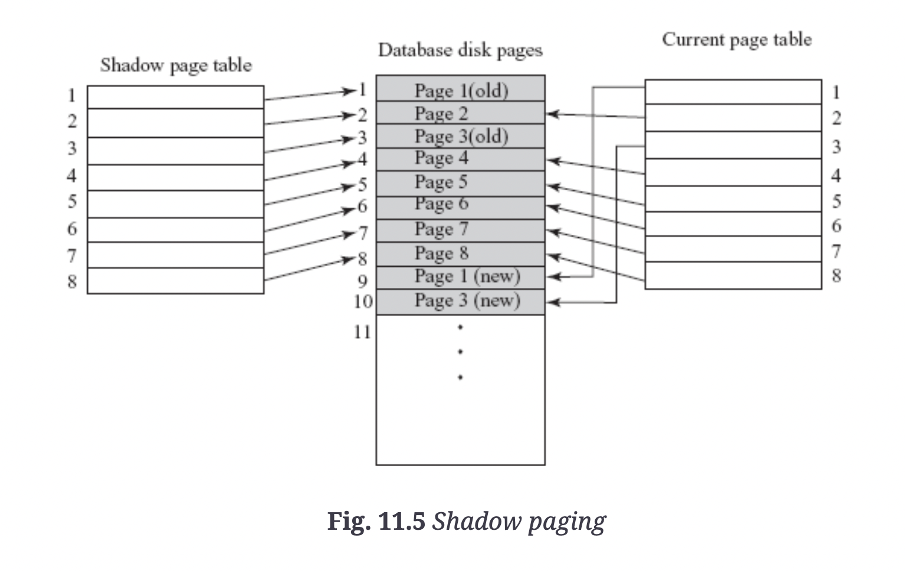

```{r setup, include=FALSE}
knitr::opts_chunk$set(echo = TRUE)
```

[recovery chapter](recovery_txt.pdf)

The **recovery manager** of a dbms performs recovery operations. 

* must preserve *atomicity* and *durability* by undoing uncommited transactions and ensuring commited changes survive failure
* tracks all changes applied to data 
* must provide **high availability**

## Types of failures

Transaction and system crash failures are non-catastrophic as no non-volatile storage is lost. 

**Logical error**: transactions fail due to logical error, eg. incorrect input, integer overflow, etc. 

**System error**: An undesirable system state, eg. deadlock, incorrect synchronization, etc. can stop normal execution

**Computer failure (system crash)**: hardware failure. Assumed to not affect contents of non-volatile storage media eg. disks (*fail-stop assumption*). 

**Disk/Media failure**: loss of data in some disk blocks due to disk read/write crash, power disruption

**Physical problems and environment disasters**: theft, fire, sabotage, floods, earthquakes, etc. 

## Caching disk pages

When transactions update database, disk pages/blocks containing data items are cached into main memory/buffer and modified there before being written back to disk. **Cache directory** is maintained to keep track of data items present in buffers. 

* when operations must be performed, cache directory searched to see if disk page resides in cache
* modified data copied back to disk using either **in place updating**, where updates are written back to original location, or **shadow paging**, where multiple copies are maintained on the disk. 

DBMS recovery terminology uses some terms to specify when modified page can be written back to database on disk. A steal/no-force approach is most desirable as it provides most freedom to cache manager when selecting replacement pages and scheduling writes. 

* **Steal/No-Steal**: updated cache page can/cannot be written to disk before the transaction commits. 
* **force/no-force**: all updated cache pages immediately/not immediately written to disk after committing. 

## Recovery steps during Normal execution

When DBMS restarted after crash, control given to recovery manager which must bring database to consistent state. In order to succeed, recovery manager maintains *system log* of all modifications to database and stores on **stable storage** guaranteed to survive failures, eg. by storing on several non-volatile storage devices. 

Work involved in recovery depends on number of changes made my committed transactions that haven't written to disk. DBMS periodically force-writes all modified buffer pages during normal execution. 

### System log

Sequence of **log records** containing essential data for each transaction: 

* **Start record** `[T_i, start]` indicates a transaction as started
* **update log record** `[T_i, X, V_o, V_n]` indicates that transaction performed update on X having old value and new value
  * maintains UNDO-type log entry and REDO-type log entry, containing before/after image of data item
* **read record** `[T_i, X]` - only required to determine necessity of cascading rollback. In practice, cascading rollback is entirely avoided and read operations not required.
* **commit record** `[T_i, commit]`
* **abort record** `[T_i, abort]`

**Write-ahead logging**: necessary to force-write all log records to stable storage *prior* to making changes to database

* transaction not allowed to update data item until all UNDO-type log records have been force-written to disk
* transaction cannot commit until REDO/UNDO have been force-written to disk
* only required for in-place updating -- in shadowing, since both BFIM and AFIM on disk recovery log not necessary

**Log-record buffering**: log records are typically collected in the log buffer and copied to stable storage at once rather than individually. 

### Checkpointing

When system restarts post-failure, log is scanned to determine transactions that must be redone, undone. 

* time-consuming
* committed transactions that wrote to database must be redone, lengthening recovery

**Checkpoints**: periodically written into the log to reduce recovery time. Transactions committed before checkpoint time do not need to be considered during recovery process -- reduces work required during recovery. When a checkpoint is taken:

1. execution of current transactions suspended
2. all log records in main memory written to SS
3. all modded buffer blocks force-written to disk
4. [checkpoint] record written to log SS
5. transaction execution resumed

**fuzzy checkpointing** writes checkpoint before buffer blocks -- allows transactions to run during potentially long buffer block writing, although record of prior checkpoint must be maintained

## Recovery techniques for serial transactions

Two primary techniques: log-based recovery techniques and shadow paging. 

### Log-based recovery

maintains transaction logs to keep track of update operations. 

*undo* and *redo* are applied with help of log on last consistent state of database. Undo reverses changes made by uncommitted transaction, while redo reapples changes of committed transaction. 

* undo and redo may also fail -- therefore they must be **idempotent**, eg. executing operations several times must be equivalent to executing once. 

There are two types of updating techniques:

* **deferred update** technique -- transaction not allowed to update database on disk until transaction enters partially committed state
  * no undos required, and log records only maintain AFIM 
  * no-steal/no-force
* **immediate update** technique -- as soon as data item modified in cache, disk copy uploaded. 
  * no redos required - steal/force approach
  * only before-image maintained
  * possibility that transactions commit before all changes written to database = steal/no-force 

### Shadow paging

before image and after image maintained on disk. Does not require log when only one transaction active at a time. 

Shadow paging considers database to be made of fixed-size units called **pages**, mapped to physical blocks of storage by using **page table**. 

* A **current page table** points to most recent db pages, and **shadow page table** contains prior version of current page table. 
* In case of failure, shadow page table used to recover database state prior to transaction.
* no-steal/force approach 

```{r out.width = '50%', fig.align = 'center'}

```

Disadvantages: 

* **data fragmentation**; updated database pages change location
* **garbage collection**: when transactions commit, database pages containing old version are garbage and its necessary to find garbage pages and add to list of free pages. 
* **harder to extend** for concurrency

## Recovery for concurrent transactions

Regardless of transaction #, a single log is maintained. IN general, higher concurrency means lengthier recovery. 

**Active list/commit list**: lists of active transactions and committed transactions since last checkpoint. 

* during UNDO/REDO recovery, write operations of transactions in commit list are redone while write operations in active list are undone. 
* NO-UNDO/REDO and UNDO/NO-REDO techniques result in the active/committed transactions being ignored. 

## ARIES Recovery Algorithm

**Algorithm for Recovery and Isolation Exploiting Semantics (ARIES)** is a widely used recovery algorithm using a steal/no-force approach (aka UNDO/REDO technique). Three main principles: 

* **write ahead logging** - log records written before db changes
* **repeating history during redo** - ARIES retraces actions of db prior to crash to bring DB to state existing at time of crash, then undos actions of uncommitted transactions
* **logging changes during undo**: separate log maintained while undoing transaction -- ensures that undo operations not repeated incase failure occurs during recovery itself

### Stored elements

Log records are assigned a unique id called **log sequence number (LSN)**, indicating address of log record on disk. 

* logs are split into sequential log files, each assigned file number. When log file grows beyond limit, new log file created. 
* each data page has **pageLSN** field set to LSN of log record corresponding to last update. during redo, log records with LSN <= page LSN of page shouldn't be executed as actions are already reflected in database. 
* set of log records for transaction stored as linked list with fields such as prevLSN, transaction ID, and type

**Transaction table** and **dirty page table** contain record for each active transaction and each dirty page in the buffer, respectively. They both store the LSN of the most recent log record for the transaction/dirty page -- for dirty page, this LSN is the earliest log record that might have to be redone for the page. 

**Compensation log record (CLR)** maintains records actions taken during rollback of an update operation. Maintains UndoNextLSN containing LSN of log record that must next be undone. 

* unique from update log records because CLRs describe already-done actions and won't need to be undone again.
* number of CLRs written during undo = # update log records for transactions not committed at time of crash

**Log tail**: the most recent portion of log, written to main memory. Periodically force-written to SS, and records updating pages, committing transactions, aborting transactions, undoing updates, and ending transactions. 

**Checkpoints** are maintained by writing a begin_checkpoint and end_checkpoint record in the log. LSN of begin_checkpoint is written to file accessed during recovery to find last checkpoint info. when end_checkpoint records are written, contents of transaction/dirty page table appended to the end of the log. 

* fuzzy checkpointing is used
* contents of modded cache buffers don't need to be flushed to disk -- transaction table and dirty page table handle it

### Post-crash restart phases

**Analysis Phase** 

* starts from begin_checkpoint record until end of log
* when end_checkpoint encountered, transaction/dirty page table are accessed and reconstructed
* by end of analysis phase, necessary info for redo and undo phase has been compiled in transaction and dirty page table

**Redo phase**: reapplies updates from log to database.

* applied to not only committed transactions -- starting point is determined by finding smallest LSN in dirty page table

**Undo phase**: rolls back all uncommitted transactions

* backward scan performed, all undo-list transactions rolled back. CLR written for each undo action

### Advantages

* simple and flexible to implement
* can support multigranularity concurrency control 
* reduces logging overhead, overheads of checkpoints, and recovery time

## Recovery from Catastrophic failures

The main technique to handle catastrophic failures is **database backup/dump** -- the entire contents of database are copied onto cheap storage materials. 

To execute database backup: 

* execution of active transactions suspended
* log records in main memory written to SS
* modded buffer blocks force-written to disk
* contents of database copied to stable storage
* [dump] record written to log on stable storage
* execution of suspended transactions resumed

Similar to steps used for checkpoints -- also similar **fuzzy dump** process used.

System log smaller than db, so backup of log records done more often than full database backup. System log restores transactions since last backup. 

Environmental disasters: Backup of db taken onto SS at a remote site used to recover lost data: **remote backup**.

* primary site = site of transaction processing. secondary site = site of remote backup. 
* when primary fails, remote site takes over processing after performing recovery using most recent backup and log records from primary site


Recovery of a system from catastrophic failures
