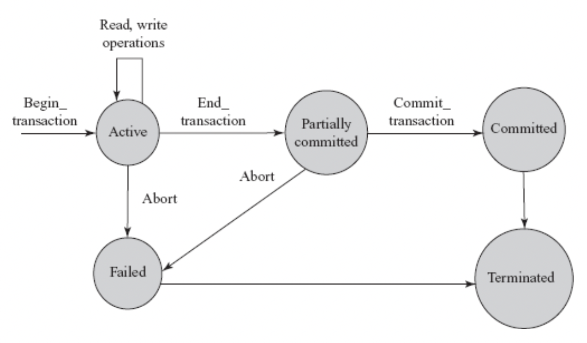
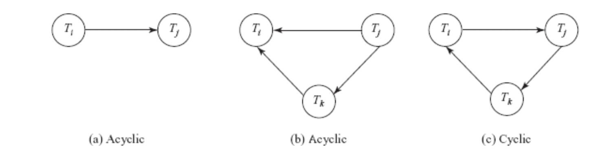

```{r setup, include=FALSE}
knitr::opts_chunk$set(echo = TRUE)
```

For background on transactions, see [Transactions in SQLite](index.html)

## Transaction States

During execution, transactions pass through various states. 

* **active**: from `begin transaction` to `end transaction` -- the operations are actively being executed
* **partially committed**: all statements are executed, output residing in main memory. update details written to log file.
* **committed**: log file written, all changes reflected permanently
* **failed**: if a transaction is aborted during active state or system fails to write changes to log file
* **terminated**: when transaction leaves the system

```{r out.width = "40%", fig.align = "center"}

```

## Concurrent Execution

Transaction processing allows for concurrent execution using interleaved execution. 

**Interleaved execution**: dbms controls execution of 2+ transactions, but only one operation occurs at a time. 

* transaction performing I/O may not use CPU at a point in time -- so CPU can process another transaction
* allows for shorter transactions to complete quickly rather than having to wait for longer transactions to finish 
* interleaving must be done carefully to avoid inconsistency using **concurrency-control techniques**

### Anomalies from Interleaved Execution

Poorly interleaved transactions can cause several types of anomalies 

* **lost update/write-write conflict**: when updates are lost because they were updated by another transaction before being updated by the first transaction
* **dirty read/write-read conflict**: when transaction fails after updating items, but another transactions before the *dirty data* is reversed
* **unrepeatable read/read-write conflict**: when a transaction reads the value of a data item twice, and another transaction updates data item in between. 

## Transaction schedules 

A list of operations form transaction set known as a **schedule** or **history**. 
  * comprises all instructions of participating transactions + preserves order of instructions within transactions
  * only relevant operations for recovery/concurrency control are reading r, writing w, aborting a, committing c

**Serial schedule**: operations of one transaction appear together (no interleaving)

  * for *n* transactions, *n!* serial schedules possible
  * every serial schedule is correct because there is no interference, but have longer runtime and are not used. 

Eg. $S_1: r_1(A); w_1(A); r_1(B); r_5(B); w_5(B); r_5(C); w_5(C);$, where $S_1$ is the schedule, A, B, and C are tables, and transaction id are subscript operations. 

**Non-serial schedule**: interleaved execution, CPU time shared among all transactions

* concurrency-control component ensures that only valid schedules are executed s.t. database is left in consistent state
* huge number of possible non-serial schedules
* **serializable schedule**: a non-serial schedule where the final output is the same as some serial schedule. 

Eg. $S_4: r_1(A); w_1(A); r_5(B); w_5(B); w_1(B); r_5(C); w_5(C);$

### Schedules Equivalence

**Result equivalence**: two schedules that produce the same final state of the database. May be accidental due to coincidences in data, so result equivalence alone is not enough to determine equivalence. 

**Conflict equivalence**: if the order of two conflicting operations is the same in both schedules 

* two operations in a schedule **conflict** if they belong to different transactions, access the same data, and one is a write operations. 
* Any other set of operations can be viably swapped
* **conflict serializable** schedules are conflict equivalent to a serial schedule
* **precedence/serialization graphs** test serializability of a schedule by considering only read/write operations. 
  * set of transaction nodes and directed edges
  * edges correlate to write/write, read/write, and read/write operations between transactions. an edge from Ti to Tj implies that transaction Ti must appear before Tj. 
  * if resulting precedence graph is acyclic, S is conflict serializable
  * **topological sorting** is the process of ordering nodes of acyclic precendence graph
  
```{r out.width = "70%", fig.align = "center"}

```

**View equivalence**: 

1) the same set of transactions are in S and S', and S and S' include the same set of operations of those transactions. 
2) as long as each transaction reads same values in both schedules, they perform same computation. 
3) the final write operation is the same in both schedules = same final state of database.

A **blind write** writes to a table without reading it first. These will appear in view serializable schedules that aren't conflict serializable. 

### Recoverable and Cascadeless Schedules

During concurrent execution, it must be ensured that a transaction that depends on another must also be rolled back. 

**Recoverable schedules**: A schedule S s.t. if Tj reads a data item written by Ti, then the commit of Ti appears before the commit of Tj. 

**Cascadeless schedule**: schedules that avoid cascading rollbacks, or needing to roll back multiple schedules because other transactions are dependent on the one rolled back. Ti and Tj are interleaved s.t. if Tj reads data written by Ti, the commit of Ti appears before the read of Tj. Cascadeless schedules are also recoverable. 

## SQL transaction statements 

In SQL:92 standard, there is no explicit `begin transaction` statement. transactions begin when SQL statements are encountered. However, explicit end statements (`commit` or `rollback`) are required. 

### Transaction characteristics 

Transactions have several characteristics specified by the `set transaction` statement

* **access mode**: `read only` or `read write`
* **diagnostic area size**: `diagnostic size n`, determines the number of error/exception conditions that can be recorded in diagnostic area. Excess errors result in only the most severe conditions being reported
* **isolation levels**: `serializable` default, transaction fully isolated from changes by other transaction. Other levels: `read uncommitted`, `read committed`, `repeatable read`, `uncommited`. `uncommited` is lowest level, where transaction can read subsequent changes from other transactions and can allow for errors. 

## BASE properties over ACID

NoSQL databases uses a flexible key/value store approach that requires an alternative to the ACID model. 

* **Basic Availability**: focus on availability of data even with multiple failures
  * uses highly distributed approach -- instead of maintaining single large data store, data spread across many storage systems with high degree of replication
  * if failure disrupts access to data segment, not necessarily complete outage
* **Soft State** - BASE abandon consistency requirements -- consistency is the developer's problem
* **Eventual Consistency** - require that at some point in future, data will converge to a consistent state 

### Use Cases

BASE not appropriate for every situation, but is flexible alternative to ACID for databases not requiring strict adherence to relational model

Optimal use case for ACID -- highly structured data with predictable inputs and outputs, eg. human-resource databases, retail databases, electronic med records

Optimal for BASE - better for fuzzy subjects, eg. emotion analysis 

