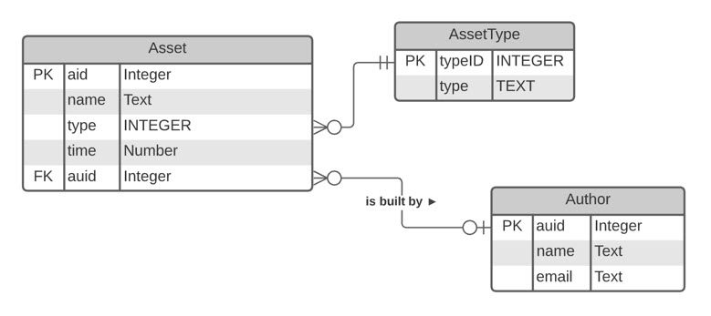

```{r setup, include=FALSE}
knitr::opts_chunk$set(echo = TRUE)
```

## Role of SQL

* SQL is standard language for data retrieval 
  * universally accepted by databases
  * also capable of processing tabular data outside of relational databases, eg. dataframes, Excel
* Queries require database connection and a means to execute 

<br>

## Flow of a Query

* Client connects to a specific database on the database server by supplying connection parameters (IP address, username, password)
* Client stores connection information in a connection object
* Client issues a query by a sending SQL statement to the database server over the network connection using the connection object
* Server checks to ensure that connected user has permission to access data and that the SQL statement is syntactically correct
* Server optimizes query and formulates a query plan based on least cost for time and memory
* Server carries out the query by retrieving the data from the storage devices and packaging the result into a temporary table, the result set
* Server sends result set back to the client
* Client stores the result set in local memory and processes the data
* Client disconnects from the database by closing the connection to the server and releasing all resources

<br>

## Database example


